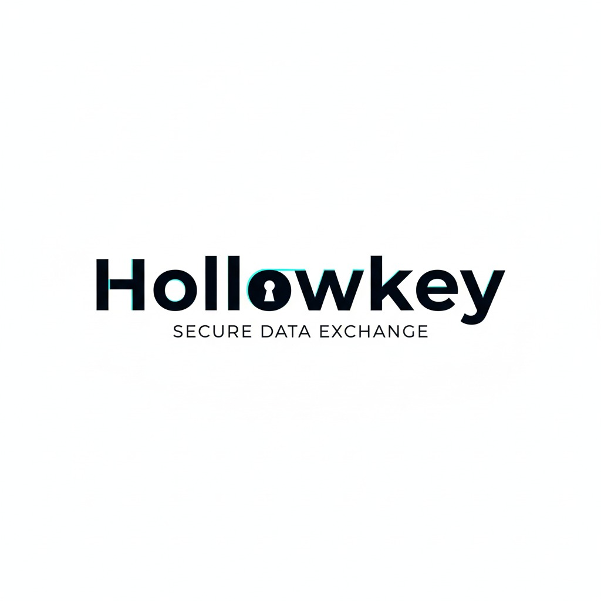

  

<b>Secure, Ephemeral Information Exchange Platform</b>

###  Overview
Hollowkey is a secure, ephemeral information exchange platform built for one-time or time-limited data sharing.  
All messages are encrypted end-to-end and automatically destroyed after being accessed or after expiry.  
No persistence. No logs. No compromise.

###  License
Licensed under the [GNU AGPLv3](https://choosealicense.com/licenses/agpl-3.0/).  
This ensures that any modified or hosted version of Hollowkey must also share its source under the same license.
